### `rohail@github ~ $ ./contributions.sh`

  

### `rohail@github ~ $ whoami`

<table>
  <tr>
    <td valign="top"></td>
    <td valign="top"></td>
  </tr>
</table>

I build practical web applications, from the UI to the server and data layer.

[GitHub](https://github.com/rohailk6) · [LinkedIn](https://www.linkedin.com/in/rohail-nawaz) · [Email](mailto:rohailn76@gmail.com)

### `rohail@github ~ $ cat stack.txt`

More projects & tools

- [Cisco RIP LAN connectivity](https://github.com/rohailk6/Cisco_RIP_LAN_Connectivity) — Three LANs connected with RIP routing.
- [Responsive newspaper layout](https://github.com/rohailk6/HTML-Newspaper-RohailNawaz_22P9367)
- [Python sticky notes app](https://github.com/rohailk6/RohailNawaz_22P9367_Sticky_Notes)

Python · TypeScript · JavaScript · C++ · HTML · CSS · Git · Cisco Packet Tracer

 

**[GitHub](https://github.com/rohailk6) · [LinkedIn](https://www.linkedin.com/in/rohail-nawaz) · [Email](mailto:rohailn76@gmail.com)**

